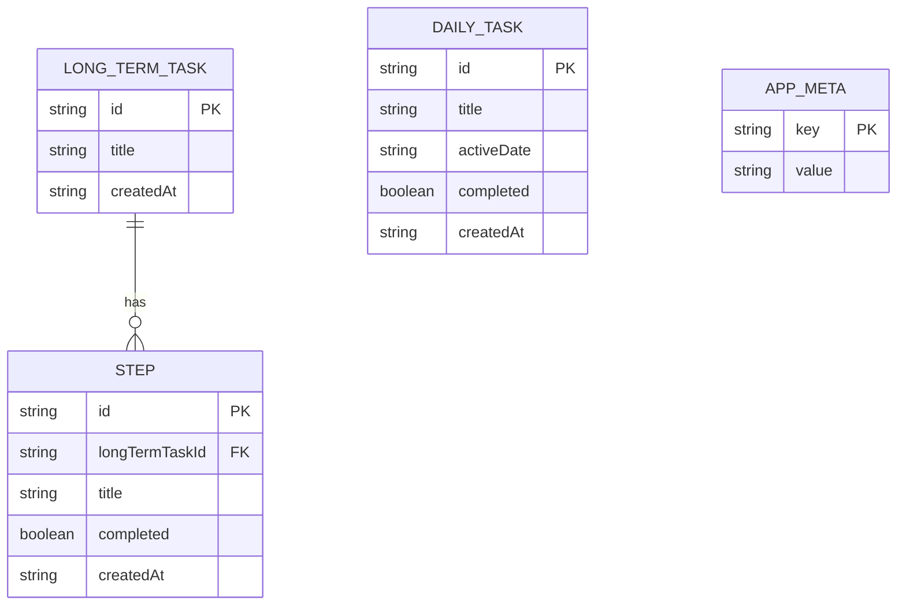

# Data model — dayflow-planner

> **Persistence:** IndexedDB (ADR-0002) — client-side object stores, no SQL server.
> **Migrations:** staged TypeScript under [`migrations/`](./migrations/) — `implement` promotes to `src/shared/storage/migrations/`.

## ER diagram



## Entities

Types use IndexedDB record vocabulary. All ids are UUID v4 strings (SAD §2). Timestamps are ISO-8601 strings in device local context. Dates are ISO calendar-day strings (`YYYY-MM-DD`) per CONTEXT glossary.

### `daily_tasks` (object store)

| Field | Type | Constraints | Notes |
|---|---|---|---|
| `id` | string (UUID) | PK (`keyPath`) | Stable identity for backup/merge (ADR-0003) |
| `title` | string | NOT NULL, non-empty on write | User-generated text; duplicate titles on same day allowed (AC-20) |
| `activeDate` | string (date) | NOT NULL | Calendar day the task belongs to; move-to-today updates this field (AC-09) |
| `completed` | boolean | NOT NULL, default `false` | Completed dailies stay on today list when completed there (AC-04) |
| `createdAt` | string (datetime) | NOT NULL | Creation order within lists (AC-17) |

**Aggregate root:** `daily_tasks` — standalone; no FK to long-term tasks.

**Access patterns:**
- Today's list → index `by_activeDate_createdAt` where `activeDate = today`, order `createdAt` ASC.
- Rolled-over block → index `by_activeDate` where `activeDate < today AND completed = false`, order `createdAt` ASC (AC-09f, AC-09b).
- Export / merge id lookup → primary key `id` (getAll keys).

### `long_term_tasks` (object store)

| Field | Type | Constraints | Notes |
|---|---|---|---|
| `id` | string (UUID) | PK (`keyPath`) | |
| `title` | string | NOT NULL, non-empty on write | |
| `createdAt` | string (datetime) | NOT NULL | List order (AC-17); latest long-term = max `createdAt`, tie-break lower `id` (CONTEXT) |

**Aggregate root:** `long_term_tasks` — owns child `steps`; cascade delete removes all steps when goal deleted (AC-12g).

**Access patterns:**
- Long-term section list → index `by_createdAt`, order ASC (AC-17, AC-12).
- Latest long-term for `+` prefix → index `by_createdAt`, order DESC, limit 1 (AC-03).

### `steps` (object store)

| Field | Type | Constraints | Notes |
|---|---|---|---|
| `id` | string (UUID) | PK (`keyPath`) | |
| `longTermTaskId` | string (UUID) | NOT NULL, FK → `long_term_tasks.id` | Indexed; cascade delete via app layer |
| `title` | string | NOT NULL, non-empty on write | Unique within parent enforced in app layer (AC-08) |
| `completed` | boolean | NOT NULL, default `false` | Progress count = completed steps / total steps |
| `createdAt` | string (datetime) | NOT NULL | Order within goal checklist (AC-17) |

**Aggregate root:** child of `long_term_tasks`.

**Access patterns:**
- Steps for goal → index `by_longTermTaskId_createdAt` where `longTermTaskId = ?`, order ASC.
- Duplicate title check → index `by_longTermTaskId_title` where `longTermTaskId = ? AND title = ?` (AC-08).

### `app_meta` (object store)

| Field | Type | Constraints | Notes |
|---|---|---|---|
| `key` | string | PK (`keyPath`) | Singleton keys |
| `value` | string | NOT NULL | Opaque string payload |

**Known keys:**
- `lastSeenCalendarDay` — ISO date (`YYYY-MM-DD`) of last dashboard day-transition check (rollover flow).
- `schemaVersion` — matches IndexedDB migration version integer.

**Aggregate root:** singleton configuration, not user data.

## Indexes

| Index | Store | Key path | Query it serves |
|---|---|---|---|
| `by_activeDate_createdAt` | `daily_tasks` | `[activeDate, createdAt]` | Today's daily list ordered oldest-first (AC-01, AC-04, AC-17) |
| `by_activeDate` | `daily_tasks` | `activeDate` | Incomplete prior-day dailies for rollover block (AC-09f, AC-09b) |
| `by_createdAt` | `long_term_tasks` | `createdAt` | Long-term section list order (AC-12, AC-17) |
| `by_createdAt_desc`* | `long_term_tasks` | `createdAt` | Latest long-term task for `+` prefix (AC-03) — query DESC in app layer |
| `by_longTermTaskId_createdAt` | `steps` | `[longTermTaskId, createdAt]` | Step checklist under goal, ordered (AC-12, AC-17) |
| `by_longTermTaskId_title` | `steps` | `[longTermTaskId, title]` | Duplicate step title check within goal (AC-08) |

\*IndexedDB indexes are single-direction; latest-long-term uses `by_createdAt` with cursor direction `prev`.

## Backup JSON shape (export/import)

Not stored in IndexedDB — file format for AC-10/AC-11:

```json
{
  "dayflowBackupVersion": 1,
  "exportedAt": "2026-06-13T12:00:00.000Z",
  "dailyTasks": [{ "id": "…", "title": "…", "activeDate": "2026-06-13", "completed": false, "createdAt": "…" }],
  "longTermTasks": [{ "id": "…", "title": "…", "createdAt": "…" }],
  "steps": [{ "id": "…", "longTermTaskId": "…", "title": "…", "completed": false, "createdAt": "…" }]
}
```

Merge import skips records whose `id` already exists in the matching store (ADR-0003). Replace import clears all three entity stores then bulk-writes backup contents.

## Test fixtures

Fixtures belong in test code, not migrations. Planned builders for `implement`:

- `buildDailyTask(overrides?)` — daily task with defaults (`activeDate = today`, `completed = false`).
- `buildLongTermTask(overrides?)` — long-term goal record.
- `buildStep(overrides?)` — step linked to a long-term task id.
- `buildBackupFile(entities?)` — valid v1 backup JSON for import tests.

PII guard: use titles like `Test task`, `Example goal` — no real personal data.
