# Software Architecture Document — dayflow-planner

## 1. Introduction and goals

**Intent.** DayFlow is an offline-first installable planner PWA for a single Planner on their own phone. It unifies fast prefix capture (daily, long-term, step), uncapped daily rollover, long-term step progress, and manual JSON backup/restore — with no accounts, no backend, and no network dependency for core flows.

**Top-3 quality goals (1-liners; full scenarios in §10):**

1. **Responsive capture** — quick-add to visible list ≤ 500 ms p95; dashboard warm load ≤ 1000 ms p95.
2. **Offline-first availability** — 100% of core read/write flows work without network.
3. **Durable local data** — 100% persistence after restart; 100% backup export completeness.

**Stakeholders.**

| Role | Interest | Sign-off owner? |
|---|---|---|
| Planner | Captures tasks, manages rollover, backs up data | No |
| Tech Lead | SAD approval, stack and persistence choices | Yes |

## 2. Constraints

**Technical.**
- TypeScript 5 + React 18 + Vite 5 with `vite-plugin-pwa` — installable SPA with service worker (ADR-0001).
- IndexedDB — sole on-device datastore via a thin async wrapper (ADR-0002).
- Feature-Sliced Design lite — `app/` → `pages/` → `features/` → `entities/` → `shared/` import rule (each layer imports only from layers below).
- No backend, no third-party services, no cloud sync in v1 (spec §3 Non-goals).

**Organisational.**
- Feature size S — ~1 week, 2–5 PRs (`.size`).
- Solo / small team; greenfield repo (docs only today).
- Run `survey` before implement to persist foundation conventions in `docs/architecture-map.md`.

**Conventions.**
- Record ids — UUID v4 for daily tasks, long-term tasks, and steps (stable identity for backup/merge).
- List ordering — creation time, oldest first (AC-17).
- Calendar day — device local timezone, advances at local midnight (CONTEXT glossary).
- Error handling — domain sentinel errors mapped to plain-language UI messages.
- English UI only in v1.

**Regulatory / external.**
- N/A — no auth boundary, no server, no regulated data fields; confidential personal text stored locally only (spec §6.1).

## 3. Context and scope

DayFlow serves a solo Planner who opens the app several times a day to capture tasks and glance at long-term progress. The system boundary is the planner's phone browser: all data stays on-device until the planner explicitly exports a backup file. v1 deliberately excludes cloud services, identity providers, and push notification platforms.

<!-- brownfield: N/A — greenfield repo -->

**External systems (in / out):**

| Actor or system | Type | Interaction |
|---|---|---|
| Planner | Person | Uses PWA — quick-add, complete, rollover, long-term section, export/import backup |
| — | — | No external systems in v1 (deliberate — offline-only, no third-party integrations) |

**C4 Context (L1):** Planner interacts with the DayFlow PWA on their phone; all persistence is internal to the browser on that device.

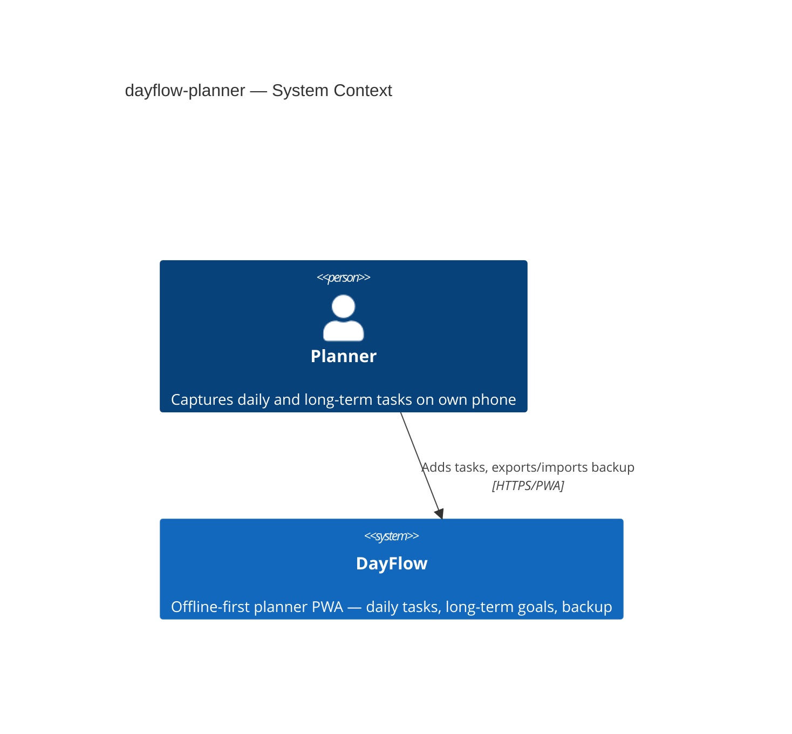

## 4. Solution strategy

**Top strategic choices:**

1. **Single web-frontend PWA surface** — Deliver as an installable React SPA with a service worker (ADR-0001). Matches AC-13 (install from browser, use offline), avoids app-store distribution and backend ops. `target_surfaces: [web-frontend]`.

2. **Client-side IndexedDB persistence** — All planner entities live in IndexedDB on the device (ADR-0002). The PWA reads/writes directly through a repository layer; there is no API container or remote datastore.

3. **Prefix-driven capture in one quick-add entry point** — Plain text → daily, `!` → long-term, `+` → step on latest long-term task. Parsing lives in a dedicated feature module; entities stay prefix-agnostic.

4. **Versioned JSON backup with identity-based merge** — Export produces a versioned JSON file with a DayFlow backup marker (AC-10). Merge import deduplicates by record UUID only (ADR-0003); replace import overwrites all local data after explicit confirmation (AC-11b).

5. **Calendar-day rollover on dashboard load** — On each dashboard open, compare stored last-seen date to today; move incomplete prior-day dailies into the rolled-over block (AC-09f). No background scheduler — event-driven by navigation.

**UI architecture (web-frontend):** Client-side SPA with client-side routing (Dashboard route + Long-term section route). IndexedDB is the source of truth; UI components hold ephemeral state (focus, edit mode, dialog open). Service worker caches the app shell for offline warm start.

## 5. Building block view

The PWA uses Feature-Sliced Design lite: pages compose features and entities; features orchestrate use cases; entities own types and storage ports; shared holds UI primitives and utilities. All layers run in one browser process — no inter-service calls.

**Internal decomposition:**

```
src/
├── app/              providers, router, PWA registration, global styles
├── pages/
│   ├── dashboard/    quick-add, today's dailies, rolled-over block
│   └── long-term/    long-term tasks + step checklists
├── features/
│   ├── quick-add/    prefix parse + create daily / long-term / step
│   ├── task-crud/    edit, complete, delete with confirm
│   ├── rollover/     move-to-today, day-transition on load
│   └── backup/       export JSON, import replace/merge
├── entities/
│   ├── daily-task/
│   ├── long-term-task/
│   └── step/
└── shared/
    ├── ui/           Input, Button, ConfirmDialog, …
    ├── lib/          date helpers, id generation
    └── storage/      IndexedDB connection + schema
```

**C4 Container (L2):** One UI container (PWA) talks to one datastore (IndexedDB); no backend container.

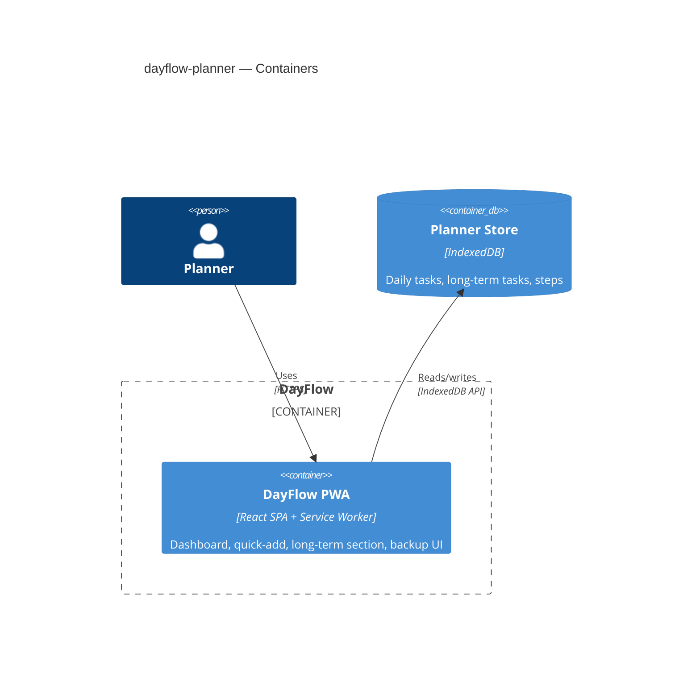

## 6. Runtime view

### Quick-add daily task (AC-01)

<!-- seed from design — concrete participant names retained -->

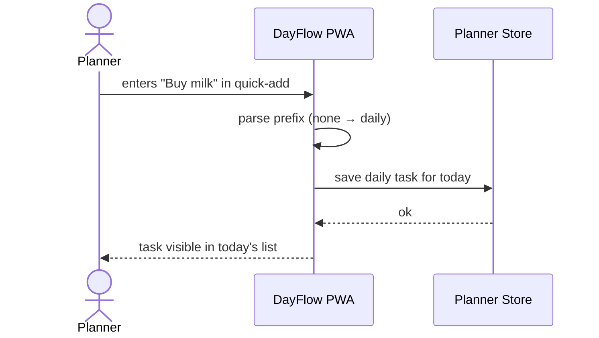

### Quick-add prefix capture (AC-02, AC-03, AC-05, AC-06, AC-08, AC-16, AC-20)

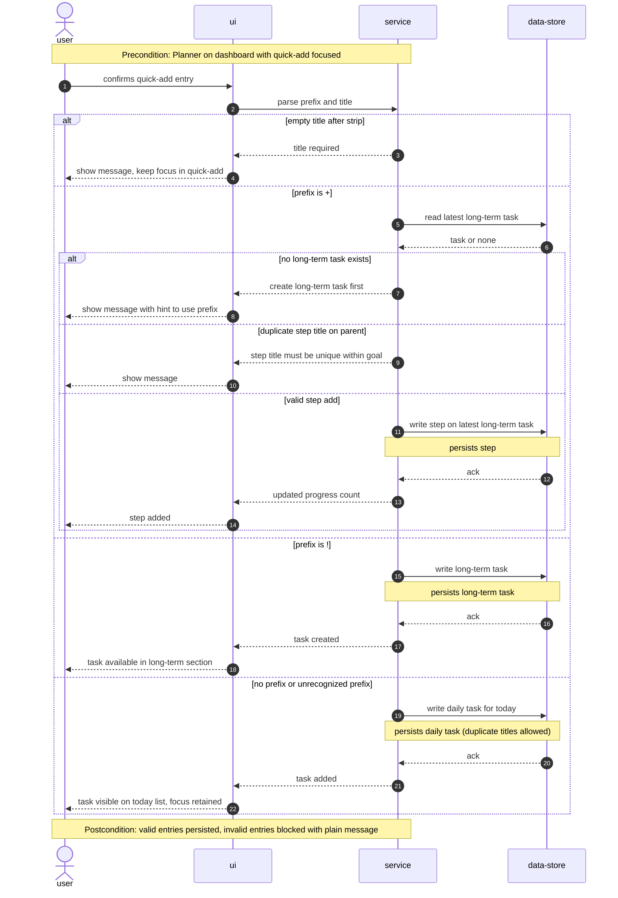

### Manage daily task on dashboard (AC-04, AC-04b, AC-04c, AC-07b, AC-14)

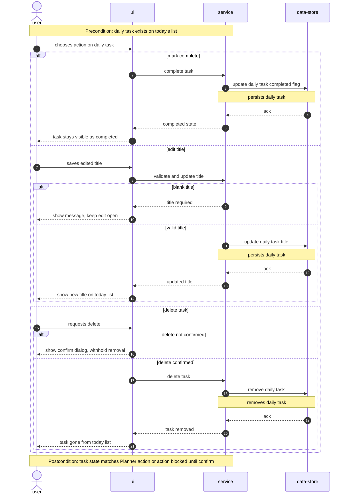

### Rollover on dashboard load (AC-09f, AC-09b)

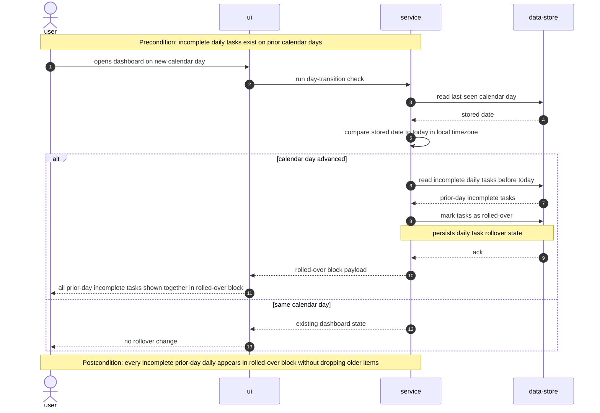

### Manage rolled-over task (AC-09, AC-09c, AC-09d, AC-09e, AC-09g)

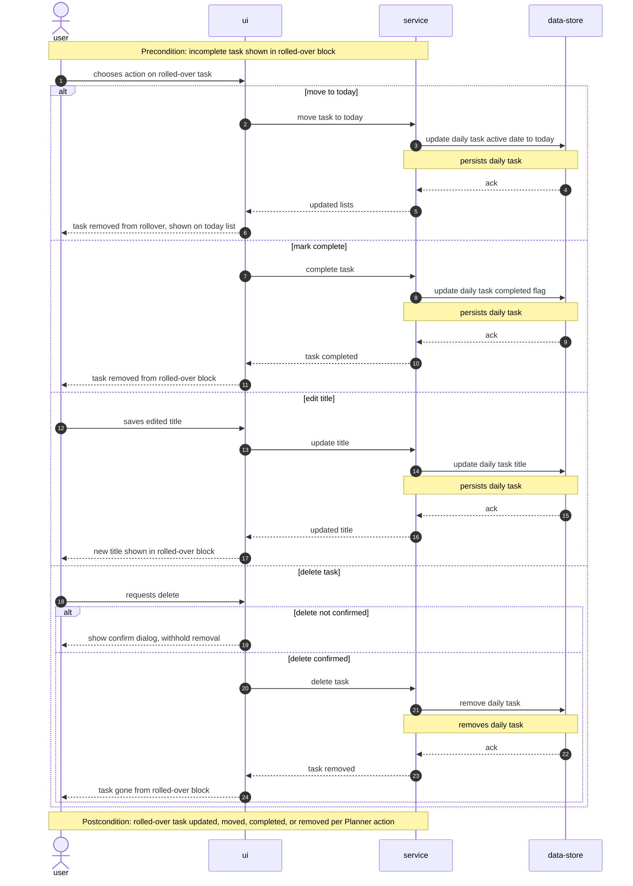

### Long-term section (AC-12, AC-12b, AC-12c, AC-12d, AC-12e, AC-12f, AC-12g, AC-12h, AC-18)

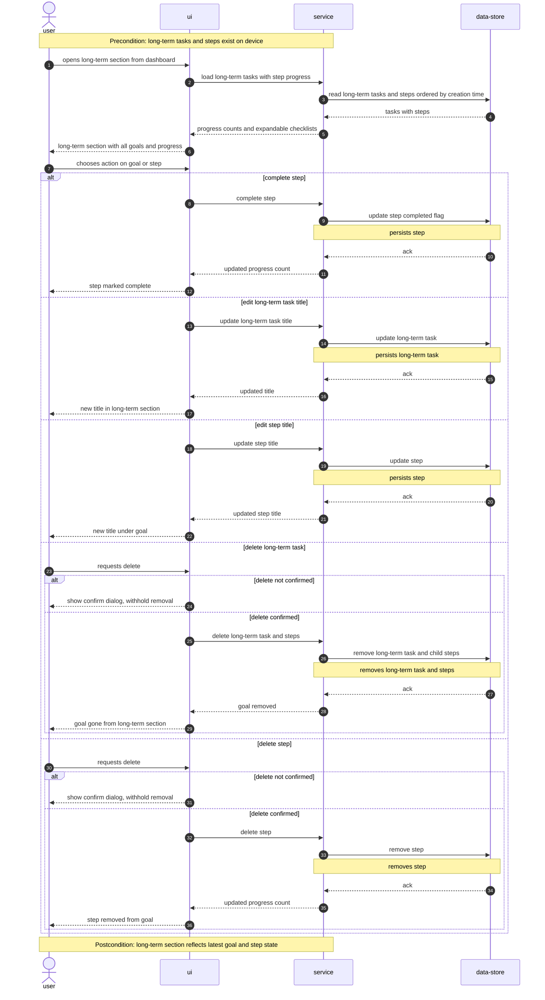

### Export backup (AC-10)

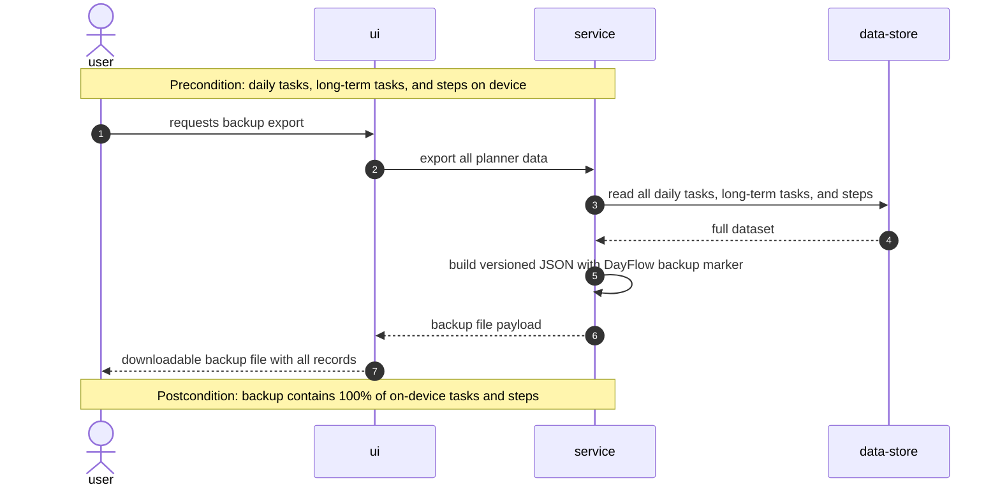

### Import backup merge (AC-11)

<!-- seed from design — concrete participant names retained -->

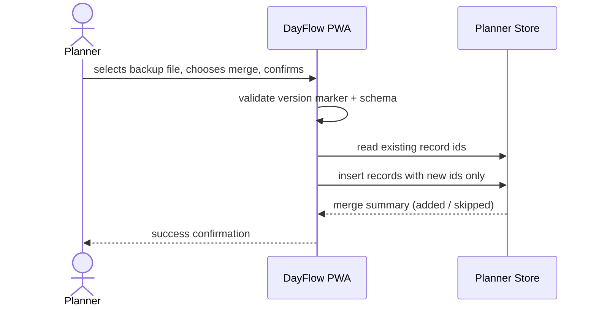

### Import backup replace (AC-11b)

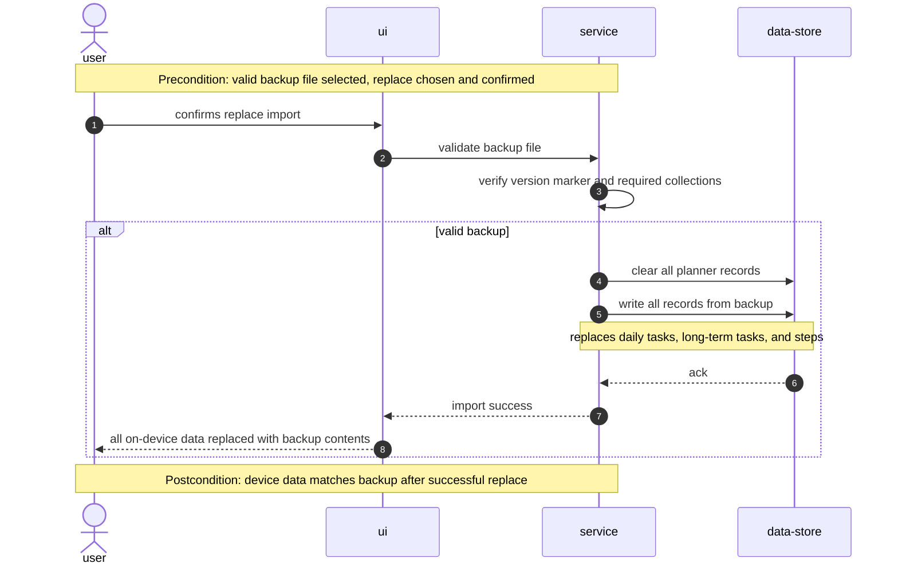

### Import validation and errors (AC-07, AC-15, AC-19)

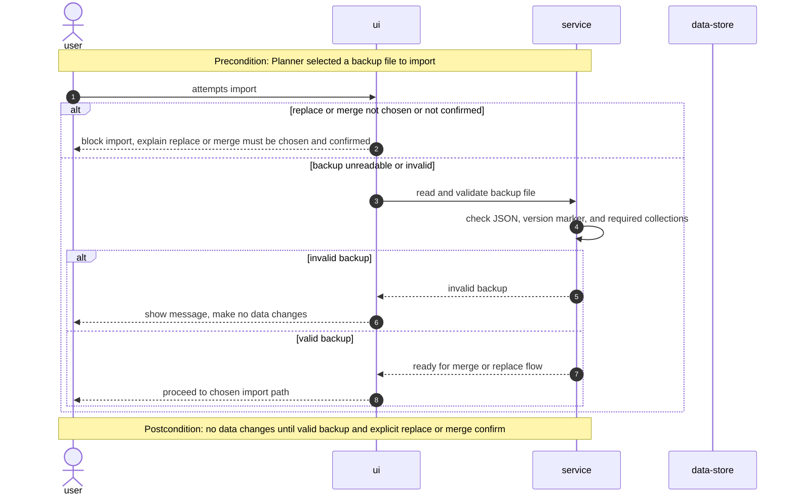

### Install and use offline (AC-13)

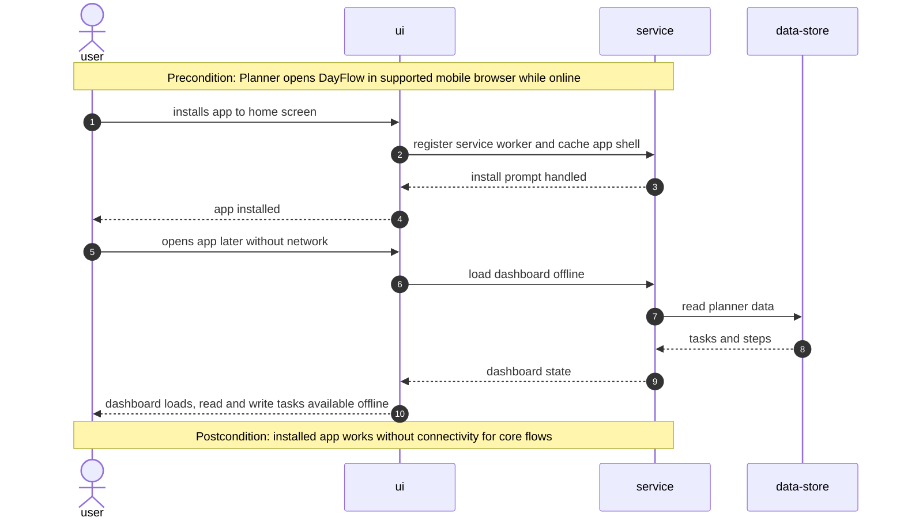

### AC coverage map

| AC | Covered by |
|---|---|
| AC-01 | Quick-add daily task (seed) |
| AC-02, AC-03, AC-05, AC-06, AC-08, AC-16, AC-20 | Quick-add prefix capture |
| AC-04, AC-04b, AC-04c, AC-07b, AC-14 | Manage daily task on dashboard |
| AC-09f, AC-09b | Rollover on dashboard load |
| AC-09, AC-09c, AC-09d, AC-09e, AC-09g | Manage rolled-over task |
| AC-12, AC-12b–h, AC-18 | Long-term section |
| AC-10 | Export backup |
| AC-11 | Import backup merge (seed) |
| AC-11b | Import backup replace |
| AC-07, AC-15, AC-19 | Import validation and errors |
| AC-13 | Install and use offline |
| AC-17 | Non-runtime N/A — creation-order sort applied on data-store read and list render |

| User story | Flow(s) |
|---|---|
| US-01 | Quick-add daily task, Quick-add prefix capture |
| US-02 | Quick-add prefix capture |
| US-03 | Quick-add prefix capture |
| US-04 | Manage daily task on dashboard |
| US-05 | Long-term section |
| US-06 | Rollover on dashboard load, Manage rolled-over task |
| US-07 | Export backup |
| US-08 | Import backup merge, Import backup replace, Import validation and errors |
| US-09 | Install and use offline |

**Flags (for design / data-model follow-up):**
- Two seed diagrams retain concrete names from `design` — new flows use generic `<user>` → `<ui>` → `<service>` → `<data-store>` vocabulary per sequences convention.
- Persist notes imply indexes on: daily task by active date and completion, long-term task by creation time, step by parent long-term task id, record id for merge dedup, last-seen calendar day for rollover.

## 7. Deployment view

<!-- N/A: app runs entirely on the planner's device as a static PWA build — no server, replicas, or cloud infra in v1 -->

The DayFlow PWA is built to static assets (HTML/JS/CSS + service worker + web manifest) and runs on the planner's phone browser after install. There is no deployment unit beyond the build artifact on the device; scaling, replicas, and server-side monitoring do not apply.

## 8. Crosscutting concepts

| Concept | Convention | Where defined |
|---|---|---|
| Logging | `console` in development; no remote telemetry in v1 | here |
| Authentication | N/A — single-planner device scope, no auth boundary | spec §6.1 |
| Authorization | Destructive actions (delete, replace/merge import) require explicit confirmation dialog | spec AC-07, AC-07b, AC-09e, AC-11b, AC-12d, AC-12f, AC-12h |
| Error handling | Domain sentinel → plain-language UI message; no silent failures on import | spec AC-05, AC-06, AC-15 |
| ID strategy | UUID v4 generated in app layer at create time | §2 Constraints |
| Merge dedup | Skip records whose id already exists on device (ADR-0003) | ADR-0003 |
| Internationalisation | English only v1 | §2 Constraints |
| Observability | N/A — no server; manual timing for latency NFRs | spec §6 NFR |
| Calendar day | Device local timezone; rollover check on dashboard load | CONTEXT glossary |

## 9. Architecture decisions

| # | Title | Status | Section |
|---|---|---|---|
| 0001 | Deliver as installable PWA SPA | Accepted | §4 |
| 0002 | Store planner data in IndexedDB | Accepted | §4, §5 |
| 0003 | Deduplicate merge import by record identity | Accepted | §4, §8 |

ADR files live under `docs/features/dayflow-planner/adr/NNNN-<title>.md`.

## 10. Quality requirements

Each top-3 goal from §1 expanded into a verifiable scenario:

**QG-1. Responsive capture**
- **When:** Planner confirms a quick-add entry on a mid-tier phone with warm app state.
- **Then:** Task appears in the list with p95 latency ≤ 500 ms (quick-add); dashboard load p95 ≤ 1000 ms (offline, warm start).
- **How verify:** Manual timing on mid-tier phone per spec §6 NFR measurement column.

**QG-2. Offline-first availability**
- **When:** Planner opens the installed PWA with network disabled.
- **Then:** 100% of core flows succeed — add, complete, rollover, long-term view, export.
- **How verify:** Checklist walkthrough per spec §6 NFR measurement column.

**QG-3. Durable local data**
- **When:** Planner creates tasks/steps, closes and reopens the app; then exports a backup.
- **Then:** 100% of records survive restart; export contains 100% of tasks and steps.
- **How verify:** Automated test — create task, reload, assert presence; export and compare counts per spec §6 NFR.

## 11. Risks and technical debt

| Risk / debt | Severity | Mitigation | Owner |
|---|---|---|---|
| Browser/OS storage eviction clears IndexedDB | High | Empty state with recovery guidance pointing to backup import (spec §8 OQ #4 — resolved) | Tech Lead |
| Accidental full replace on import | Medium | Explicit replace confirmation; default screen explains overwrite (spec §6.1) | Tech Lead |
| PWA install UX varies by mobile browser | Medium | Test AC-13 on iOS Safari + Android Chrome; document supported browsers in README | Tech Lead |
| No convention file yet (greenfield) | Medium | Run `survey` before implement to persist stack + layout in `architecture-map.md` | Tech Lead |
| Merge cannot dedupe semantically identical tasks with different ids | Low | Document in import summary; v2 optional title-based merge mode | Tech Lead |
| Onboarding copy for first export not finalized | Open question | One-time post-install hint on dashboard (spec §8 OQ #2 default) — resolve copy before tasks | PM |

**Resolved open questions (from spec §8):**

| Question | Resolution | Owner | Resolved |
|---|---|---|---|
| Merge import dedup — identity vs title/date (OQ #1) | Exact record identity only (ADR-0003) | Tech Lead | 2026-06-13 |
| Storage unexpectedly cleared (OQ #4) | Empty state + recovery guidance → backup import | Tech Lead | 2026-06-13 |
| Swipe-to-delete in v1 (OQ #3) | Button-only edit/delete acceptable for S scope | PM | 2026-06-13 (deferred detail to tasks) |

**Accepted debt (acceptable in v1, plan to fix later):**
- Button-only delete/edit — no swipe gestures (spec §8 OQ #3 deferred to tasks stage).
- English-only UI — i18n deferred until post-v1 signal.
- No drag-and-drop reorder — creation order only (spec §3 Non-goals).

## 12. Glossary

| Term | Meaning |
|---|---|
| Backup file | Full export of all daily tasks, long-term tasks, and steps as versioned JSON with a DayFlow backup version marker |
| Calendar day | Active date for a daily task — device local timezone, advances at local midnight |
| Daily task | Single action for a specific calendar day on the dashboard |
| Dashboard | Main screen — quick-add, today's dailies, rolled-over block |
| Latest long-term task | Long-term task with most recent creation timestamp; ties break to lower internal id |
| Long-term task | Multi-step objective tracked over weeks/months |
| Long-term section | Separate tab/screen for long-term tasks and steps |
| Planner | Individual using DayFlow on their own device |
| Rolled-over task | Incomplete daily from a past date, shown until moved to today or completed |
| Step | Checklist item belonging to exactly one long-term task |
