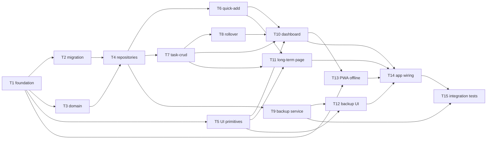

# Epic — dayflow-planner

> **Spec:** [spec.md](../spec.md) · **Design:** [sad.md](../sad.md) · **Data model:** [data-model.md](../data-model.md) · **ADRs:** [adr/](../adr/)

## Goal

Ship an offline-first installable DayFlow PWA on the planner's phone: prefix quick-add, today's dailies with uncapped rollover, long-term step progress, and manual JSON backup/restore — all persisted locally in IndexedDB with no backend.

## Scope

- **In:** Vite + React 18 + TypeScript PWA (ADR-0001); IndexedDB persistence (ADR-0002); FSD-lite layers (`app/` → `pages/` → `features/` → `entities/` → `shared/`); domain validation; repository layer; quick-add, task-crud, rollover, backup features; dashboard + long-term pages; shared UI primitives; PWA service worker; integration tests for persistence and backup.
- **Out:** Cloud sync, accounts, push notifications, drag-and-drop reorder, swipe gestures, multi-user, backend/API (spec §3 Non-goals).

## Task map

## Tasks

See [tracker.md](./tracker.md) for status. Machine contract: [tasks.json](../tasks.json).

| # | Task | Layer | Blocked by | DoD (short) |
|---|---|---|---|---|
| T1 | Scaffold Vite React PWA + FSD skeleton | wiring | — | Dev server runs; router shell; FSD import rule enforced |
| T2 | Promote IndexedDB v1 schema migration | migration | T1 | Staged migration applies and reverts in fake-indexeddb |
| T3 | Define planner domain types and validation | domain | T1 | Unit tests for prefix/title/duplicate-step invariants pass |
| T4 | Implement IndexedDB repositories | infra | T2, T3 | CRUD + ordered queries match data-model access patterns |
| T5 | Build shared UI primitives | ui | T1 | Input, Button, Checkbox, ConfirmDialog render and are keyboard-accessible |
| T6 | Implement quick-add feature | app | T4 | Prefix capture persists daily/long-term/step per sad §6 flow |
| T7 | Implement task-crud feature | app | T4 | Complete/edit/delete with confirm for daily, goal, and step |
| T8 | Implement rollover feature | app | T4, T7 | Day-transition + rolled-over block actions match AC-09* |
| T9 | Implement backup export/import service | app | T4 | Versioned JSON export; replace/merge/validate per ADR-0003 |
| T10 | Build dashboard page | ui | T5, T6, T7, T8 | Quick-add, today list, rolled-over block wired to features |
| T11 | Build long-term page | ui | T5, T6, T7 | Goals with progress counts and expandable step checklists |
| T12 | Build backup settings UI | ui | T5, T9 | Export download + import replace/merge confirm flows |
| T13 | Wire PWA offline shell | wiring | T1, T10 | Service worker caches shell; AC-13 offline read/write works |
| T14 | Compose app routing and empty-state recovery | wiring | T10–T13 | Dashboard ↔ long-term nav; storage-cleared recovery guidance |
| T15 | Add core integration tests | tests | T9, T14 | Persistence-after-reload and backup round-trip tests pass |

## Risks / Hard rules

- **FSD import rule:** each layer imports only from layers below (`sad.md` §5) — no cross-feature or upward imports.
- **No backend:** all persistence is IndexedDB on device; no API layer or network calls for core flows.
- **Merge dedup:** identity-only by record UUID (ADR-0003) — do not dedupe by title/date in v1.
- **Destructive actions:** delete and replace/merge import require explicit ConfirmDialog (spec AC-07b, AC-09e, AC-12d/f).
- **Button-only edit/delete:** no swipe gestures (spec §8 OQ #3, resolved in `sad.md` §11).
- **Latency NFRs:** quick-add ≤ 500 ms p95; dashboard warm load ≤ 1000 ms p95 (spec §6) — avoid blocking main thread on reads.
